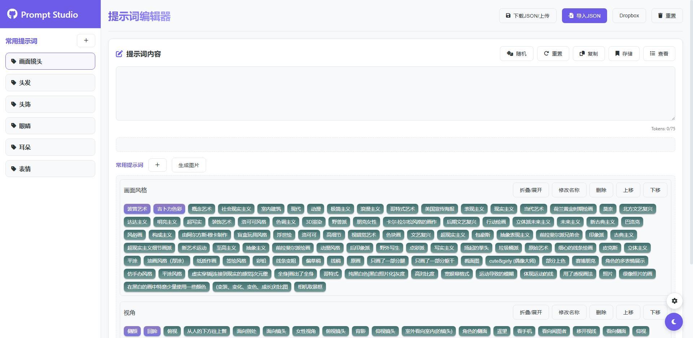
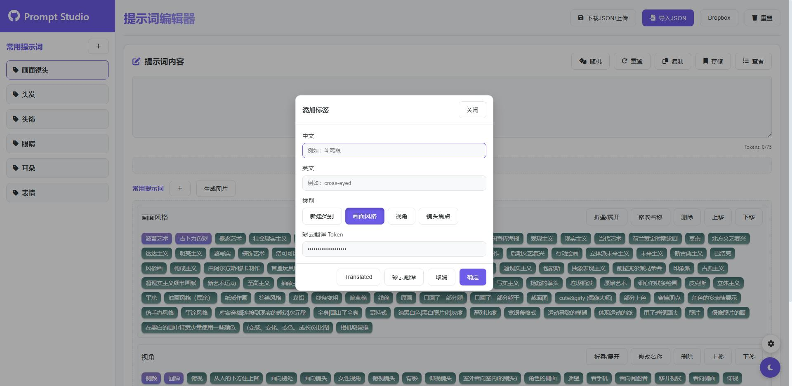
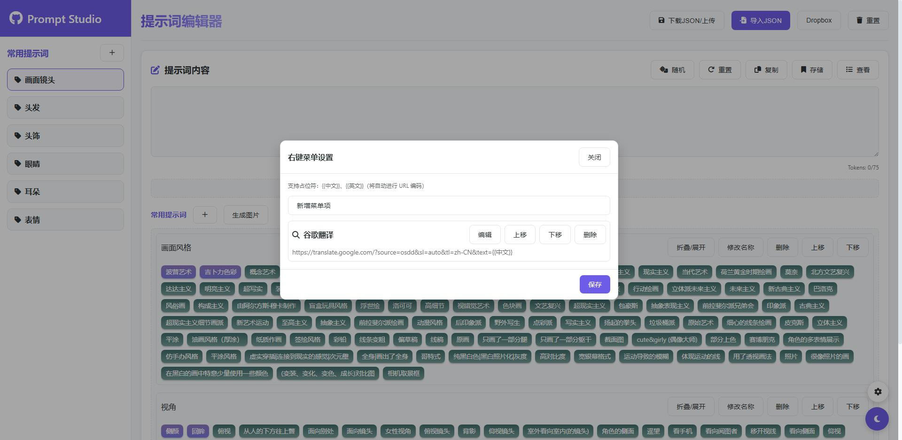
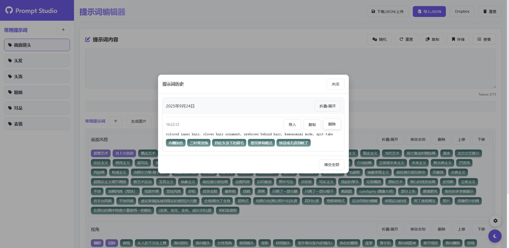

# IIIStudio - AI绘画提示词工具

一个纯前端的提示词管理与编辑页面。支持分类/分组管理、标签拖拽排序、历史快照存储、翻译、JSON 导入/导出、本地持久化，以及可选的 Dropbox 云同步；同时提供一键导出提示词区域为图片（html2canvas）。

B站演示：https://www.bilibili.com/video/BV1VgykBQEp5/

## 更新日志
2026-02-03
- 把提示词置顶改为标记
- 添加关联提示词，支持`，,;；`为分割，如果多个可以使用`|`。例如：概念艺术，小猫,小狗|抚摸
- 修改取消点击提示词回到顶部，添加回到顶部

2026-02-01
- 添加腾讯云COS同步
- 添加添加支持标签移动位置
- 添加支持批量添加标签，使用分号(;)或顿号(、)分隔
- 添加搜索功能
- 添加分类右键菜单及编辑功能
- 调整css

2025-10-28
- 添加prompt-tags区域右键提示词权重+-与删除按键。

2025-10-27
- 添加合成提示词按键，选择图片把提示词图片合成上去，**注意如果提示词不够清晰，可以修改窗口大小再合成。**
- 添加在提示词内输入中文自动转化为json中的英文

2025-10-04
- 新增侧栏分类拖拽排序功能，优化Dropbox配置并添加首次使用引导
- 优化导入关闭窗口逻辑，修复部分bug
- 添加交互回车键提交与ESC键取消逻辑

## 功能一览

- 分类管理
  - 新建/编辑/删除分类
  - 分组（子类）管理与显式顺序控制（groupsOrder 上移/下移）
  - 右键菜单：分类上移/下移、编辑名称、删除
- 提示词标签
  - 新增/编辑/删除标签，支持中英双段（text / lang_zh）
  - 标签置顶/取消置顶
  - 拖拽排序（支持多行容器空白区域精准插入）
  - 可配置自定义右键菜单外链（基于模板构建 URL）
- 编辑器与历史
  - 编辑器内容与标签联动
  - 一键存储当前提示词快照；支持历史列表查看、删除、清空
- 数据存储与导入/导出
  - 本地存储到 localStorage（常用提示词、历史、菜单配置）
  - 导入/导出 JSON（本地文件或 Dropbox）
  - 支持兼容多种结构：旧版纯对象、新版封装、分组版
- 主题与外观
  - 亮/暗主题切换（跟随系统偏好并持久化）
  - 现代化 UI，Font Awesome 图标
- 图片导出
  - 使用 html2canvas 将提示词区域导出为透明背景 PNG
- 标签右键链接（可选）
  - 可在设置中设置标签搜索链接
- 云同步（可选）
  - Dropbox OAuth 登录后上传/下载 JSON
  - 文件列表刷新与文件选择
- 翻译（可选）
  - 可以使用彩云翻译 API 进行中英互译
  - 支持Translated翻译

## Dropbox 云同步（可选）

- 打开“Dropbox”配置窗口，填写 `App Key / App Secret`，完成 OAuth 登录。
- 登录成功后将保存刷新令牌并获取访问令牌，可进行上传/下载。
- 选择或刷新云端 JSON 文件列表，支持将数据上传到应用目录或从中导入。

1. 打开网站：https://www.dropbox.com/developers/apps，登录点击Create app。
2. 选择：App folder– Access to a single folder created specifically for your app.
3. 输入 Name your app 名称，这个名称会在你应用中创建文件夹，提示词文件也放在这个文件夹，权限是只能获取到这个文件夹的文件。
4. 复制App key与App secret
5. OAuth 2 Redirect URIs 写入 https://localhost/
6. 在 Permissions 勾选权限，files.content.write与files.content.read，点击Submit提交，这样就完成了

> 如果找不到位置可以使用Ctrl+f搜索。

说明：
- 上传时对非 ASCII 文件名进行兼容处理：临时文件 + move 接口。
- 下载时 ASCII 文件走标准 `content` 接口；非 ASCII 文件使用临时链接获取。

## S3 (腾讯云 COS)（可选）

**重要：必须配置 CORS 才能使用！**

- [创建子账户](https://console.cloud.tencent.com/cam/user/create?systemType=FastCreateV2)
  - 选择访问方式 → 编程访问 → 创建用户
  - 复制你的 API 密钥的 SecretId 和 SecretKey
- 在 COS 控制台创建存储桶，记录 Bucket 名称和所在区域
- 添加权限 COS 控制台 → 存储桶 → 权限管理 → 添加成员 → 输入子账户 ID → 添加权限：数据读取、数据写入
- 配置 CORS（必须）：在 COS 控制台 → 存储桶 → 安全管理 → 跨域访问 CORS，添加规则：
  - 来源 Origin：*
  - 操作 Methods：GET, PUT, POST, DELETE, HEAD
  - 其他默认

使用JS：[cos-js-sdk-v5](https://cdn.jsdelivr.net/npm/cos-js-sdk-v5/dist/cos-js-sdk-v5.min.js)

## 彩云api（可选）

- 地址：https://platform.caiyunapp.com/login
- 好像是每月100万字翻译字符数，完全够用
- 创建应用获取Token